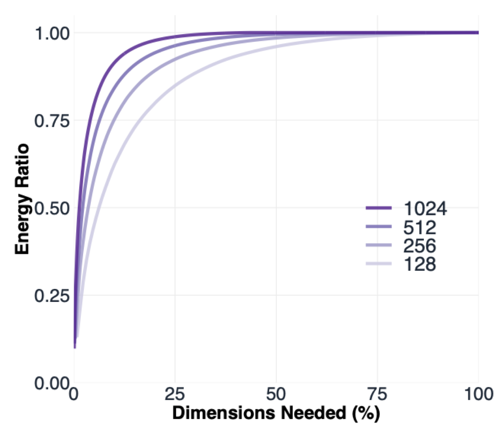
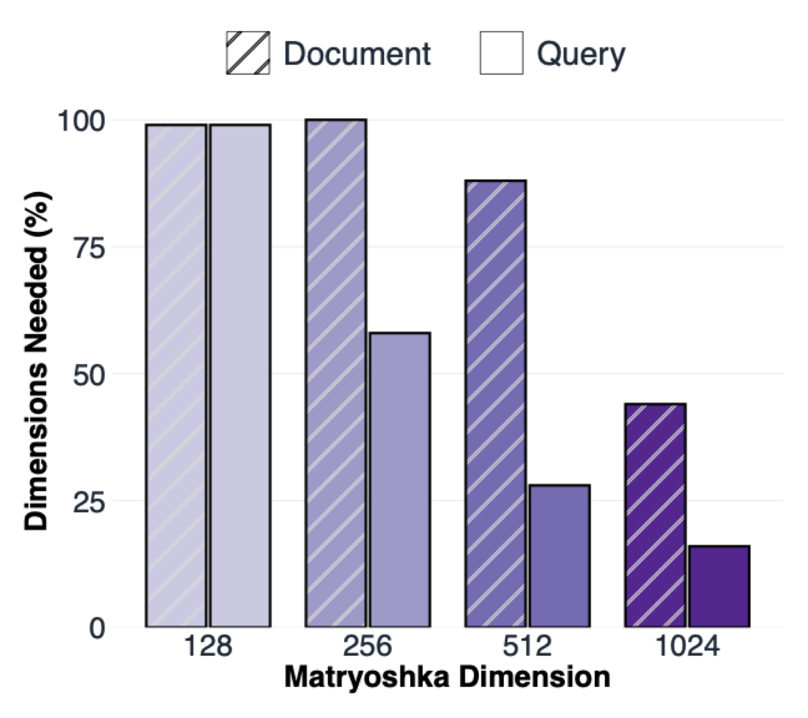
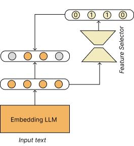

# You Don’t Need Sparse Autoencoders to Sparsify Embedding Models

Post-training sparsification of dense embedding models is useful for reducing disk storage, and can significantly accelerate retrieval with efficient GPU kernels. Some recent works propose Sparse Autoencoders (SAEs) to learn sparse embeddings, a sparsifyication method that learns to project dense representations into a higher dimension but that contain less active dimensions. I show that SAEs has many limitations, and are not necessary to learn sparse representaions. In practice, pretrained embedding models already produce representations that are highly low-rank. Instead of using SAE to learn a new sparse space, I show it is possible to train a lightweight linear layer that lean to directly select active neurons. This approach is simpler and more adaptive than SAEs.

## Sparsifing vectors with SAEs

Sparse Autoencoders sparsify pretrained embeddings by learning a function $z = f(x)$ that maps a dense vector $x \in \mathbb{R}^d$ to a higher-dimensional representation $z \in \mathbb{R}^D$ (with $D > d$), while enforcing sparsity on $z$. After training, only a small subset of the coordinates of $z$ are active, yielding a sparse representation. The core question is how to enforce sparsity. A common approach is to use TopK-SAE, which uses _topk_ to learn _k_ active dimensions during training. Typically, $k$ is defined once at training time.

SAEs for sparse embeddings have many limitations. First, they require projecting the original vector into a space that is often 4x larger, which can introduce additional latency during document indexing. Second, the approach is rigid and not truly adaptive, since the number of active dimensions is typically fixed during training and cannot be changed at inference time, limiting compute adaptivity in real-world deployment. Moreover, the top-k operation used to enforce sparsity is not differentiable everywhere, which can make training unstable.

I argue that pre-trained embedding models already learn low-rank structure, such that we can just train a small linear layer to learn to select which dimension to activate. No need to project the embeddings into a higher dimension. No need top-k, so all is fully differentiable and converges extremely fast. This approach is also more compute-adaptive, allowing to choose the number of dimensions to keep active at inference-time. Before going into the method, I want to convice you that learned representations by embedding models are extremely low-rank.

## Embedding models learn low-rank representations
Modern embedding models are large models pre-trained on large-scale multi-domain datasets. The fact that these models perform well on a wide range of domain suggests that different domains lies in different sub-spaces of the full representation space. Then this also means that the representation of a given input from a given domain is low-rank, since it lies in a sub-space.

I show here that text embeddings are extremely low-rank. I show this on a wide range of embedding sizes using Qwen3-Embedding-0.6B, which is a matryoshka model. We measure the rank of embeddings as the number of dimensions needed in the embedding vector to represent the full information. More formally, we analyze the cumulative energy ratio $R(k)$, which is the proportion of total variance explained by the top-k eigenvalues of the covariance matrix of the embedding:

$$R(k) = \frac{\sum_{i=1}^{k} \lambda_i}{\sum_{j=1}^{d} \lambda_j}, \;\; \text{for } k \in \{1, 2, \ldots, d\}$$

Where $\lambda_i$ are the eigenvalues of the covariance matrix, sorted in descending order: $\lambda_1 \geq \lambda_2 \geq \ldots \geq \lambda_d$. For each Matryoshka dimension, we compute the covariance matrix and used it to compute ratio $R(k)$.
This ratio tells us how the information is spread within the Matryoshka vector. If the vector is low rank, then $R$ reaches $1.0$ ($100%$) more quickly, which means it needs only few dimensions to represent the full information.

### Only few dimensions are needed to represent the full information 

<figure style="margin:1.2rem auto; max-width:300px;">
  
  <figcaption style="text-align:center; font-size:0.9rem; margin-top:0.4rem;">
    Cumulative energy ratio R(k) across Matryoshka embedding dimensions.
  </figcaption>
</figure>

The figure shows that only a small percent of dimensions is needed to represent the full information. Higher dimensions reach $1.0$ ($100%$) more quickly, indicating they are lower rank and require only a small fraction of the dimensions to represent the full information.

### The text length matters

Most embedding models represent text with a single vector, by pooling together all the token vectors in the text. There are many pooling operations, the one used in Qwen3-Embedding is an average. Naturally, averaging over a long sequence will compact more information, which means longer text might have higher ranks. Comparing document and query embeddings, this figure shows that document embeddings need more components than query embeddings to represent the full information, which makes sense since documents are much longer. This observation suggest that sparsification methods must adaptive: introducing more or less sparsity depending on the text length.

<figure style="margin:1.2rem auto; max-width:300px;">
  
  <figcaption style="text-align:center; font-size:0.9rem; margin-top:0.4rem;">
    The ratio of dimensions needed to represent the information in document and query.
  </figcaption>
</figure>

## Sparsifing with Feature Selectors
So far, we've seen that embedding vectors from pre-trained models are already extremely low-rank, such that we probably don't need to enforce their low-rank structure or sparsity as done in SAE approaches. We could just train a simple a feature selector to activate important components in the embedding vectors. Let's try this, and see how it performs compared to SAE approaches. Figure 3 shows how it works. The input text is embedded by the embedding model, and the feature selector, which a simple linear layer, predicts if each unit of the vector should be activated or not. In the Figure, the feature selector predicts that the units 2 and 3 should be activated while the units 1 and 4 are not.

<figure style="margin:1.2rem auto; max-width:300px;">
  
  <figcaption style="text-align:center; font-size:0.9rem; margin-top:0.4rem;">
    The ratio of dimensions needed to represent the information in document and query.
  </figcaption>
</figure>

The remaining question is how to define this feature selector function and how to train it since it requires discrete decisions which is not differentiable: activate or not the unit. I propose two approaches. The fist, which i call _hard_ decision trains the feature selector to converge towards concrete decision of 1 (keep the unit) or 0 (discard the unit). The second approach, which i call _soft_ decision simply trains the feature selector to concentrate the probability mass towards O or 1 without enforcing a discrete decision.

### _Hard_ Feature Selection
For this approach, I take inspiration from Hard-Concrete distribution, which is a reparametrization method for learning discrete parameters in a fully differentiable way. This approach is not input-dependant, as it trains weight to converge towards static 0 or 1, while we need the feature selector to produce activations that are 0 or 1 based on the given input. To do so, we simply make introduce an input dependant transformation in the Hard-Concrete method.

$$
\begin{aligned}
f_s(x):\quad
&\text{1 - } \mathbf{u} \sim U(0,1),\\
&\text{2 - } \mathbf{s}(x)=\operatorname{sigmoid}\!\left(\log \mathbf{u}-\log(1-\mathbf{u})+\boldsymbol{\alpha}(x)\right),\\
&\text{3 - } \bar{\mathbf{s}}(x)=\mathbf{s}(x)(r-l)+l,\\
&\text{4 - } \textbf{m}=\min\!\left(1,\max\!\left(0,\bar{\mathbf{s}}(x)\right)\right).
\end{aligned}
$$

This function produces $\textbf{m}$ which is the mask, the feature selection decision. The training is done by minimizing the retrieval loss on the masked input and also the number of active units by minimizing the $s(x)$

$$
\mathcal{L}(x) = \mathbf{s}(x) + \mathcal{L^{r}}(x * \textbf{m})
$$

### _Soft_ Feature Selection